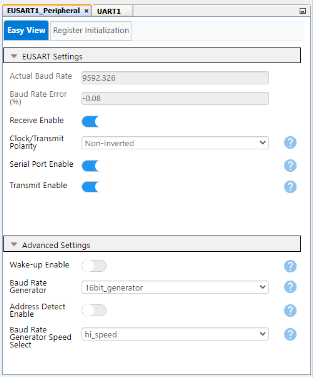
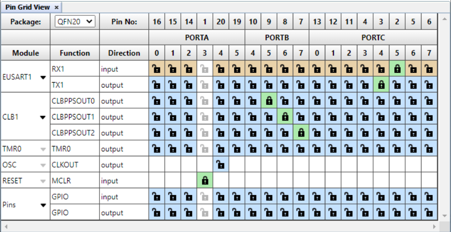

<!-- Please do not change this html logo with link -->

<a href="https://www.microchip.com" rel="nofollow"></a>

# Tachometer — Use Case for CLB using the PIC16F13145 Microcontroller with MCC Melody

This repository provides an MPLAB® X project for interfacing the Configurable Logic Block (CLB) with Timer0 (TMR0) and Timer1 (TMR1) peripherals to control a Switec stepper motor. By the end of this example, you will be able to provide a degree of rotation (0-315) and have the stepper motor move to that angle.

The CLB peripheral is a collection of logic elements that can be programmed to perform a wide variety of digital logic functions. The logic function may be completely combinatorial, sequential, or a combination of the two, enabling users to incorporate hardware-based custom logic into their applications.


## Related Documentation

More details and code examples on the PIC16F13145 can be found at the following links:

- [PIC16F13145 Product Page](https://www.microchip.com/en-us/product/PIC16F13145?utm_source=GitHub&utm_medium=TextLink&utm_campaign=MCU8_MMTCha_PIC16F13145&utm_content=pic16f13145-tachometer-mplab-mcc&utm_bu=MCU08)
- [PIC16F13145 Code Examples on Discover](https://mplab-discover.microchip.com/v2?dsl=PIC16F13145)
- [PIC16F13145 Code Examples on GitHub](https://github.com/microchip-pic-avr-examples/?q=PIC16F13145)
- [Switec Stepper Motor X25.xxx Datasheet](https://assets.componentsense.com/images/pdfs/1403534641064_X25-278.pdf)


## Software Used

- [MPLAB X IDE v6.15 or newer](https://www.microchip.com/en-us/tools-resources/develop/mplab-x-ide?utm_source=GitHub&utm_medium=TextLink&utm_campaign=MCU8_MMTCha_PIC16F13145&utm_content=pic16f13145-tachometer-mplab-mcc&utm_bu=MCU08)
- [MPLAB® XC8 v2.45 or newer](https://www.microchip.com/en-us/tools-resources/develop/mplab-xc-compilers?utm_source=GitHub&utm_medium=TextLink&utm_campaign=MCU8_MMTCha_PIC16F13145&utm_content=pic16f13145-tachometer-mplab-mcc&utm_bu=MCU08)
- [PIC16F1xxxx_DFP v1.23.382 or newer](https://packs.download.microchip.com/)

## Hardware Used

- The [PIC16F13145 Curiosity Nano Development board](https://www.microchip.com/en-us/development-tool/EV06M52A?utm_source=GitHub&utm_medium=TextLink&utm_campaign=MCU8_MMTCha_PIC16F13145&utm_content=pic16f13145-tachometer-mplab-mcc&utm_bu=MCU08) is used as a test platform:
    <br>

- Switec Stepper Motor:
    <br>

- Logic Analyzer


## Operation

To program the Curiosity Nano board with this MPLAB X project, follow the steps provided in the [How to Program the Curiosity Nano Board](#how-to-program-the-curiosity-nano-board) chapter.<br><br>

## Concept

This example demonstrates the capabilities of the CLB, a Core Independent Peripheral (CIP), that can control and manipulate the Switec stepper motor. The figure below shows the implemented solution.

<br>

Two bits of the CLB Software Input Register (CLBSWIN) are used as synchronized inputs to enable the CLB circuit (CLBSWIN0) and to select the direction (CLBSWIN1), clockwise if set in software ```0```, or counterclockwise if ```1```.

The TMR0 peripheral is configured as 8-bit timer to define a 2 milliseconds periodically signal needed for this type of stepper motor to be controlled, as described in its datasheet.

The TMR1 peripheral is used to count the TMR0 interrupt overflows, and rolls over after a set number in software of rotation steps. To define a full step, 3 partial steps are needed, as in the above figure from the datasheet.

<br>

The Interrupt Request 0 (IRQ) of the CLB is used for the TMR1 overflow, instead of timers' one because the CLB circuit will introduce two CLB clocks delay and the interrupt could be missed in software.

When the application starts, the shaft of the motor is set to an initial position, so that the motor always starts from a fixed position and is defined to the left of the dial. Using the Enhanced Universal Synchronous Asynchronous Receiver Transmitter (EUSART) peripheral, a position can be sent via PC terminal and observed on the external hardware.

The UART peripheral is used to control the shaft position of the motor. The user must send a value between 0 and 315 to set the desired position and the specific " `\n` " character at the end of the line for a right interpretation into the software application. Specific messages are also displayed in the terminal as in the below picture.
<br>

## Setup 

The following peripheral and clock configurations are set up using MPLAB® Code Configurator (MCC) Melody for the PIC16F13145:

1. Configurations Bits:
    - CONFIG1:
        - External Oscillator mode selection bits: Oscillator not enabled
        - Power-up default value for COSC bits: HFINTOSC (1MHz)
        <br>
    - CONFIG2:
        - Brown-out reset enable bits: Brown-out reset disabled
        <br>
    - CONFIG3:
        - WDT operating mode: WDT Disabled, SEN is ignored
        <br>

2. Clock Control:
    - Clock Source: HFINTOSC
    - HF Internal Clock: 16_MHz
    - Clock Divider: 1
    <br>

3. CLB1:
    - Enable CLB: Enabled
    - Clock Selection: TMR0_Overflow
    - Clock Divider: Divide clock source by 1
    <br> 

4. CRC:
    - Auto-configured by CLB

5. NVM:
    - Auto-configured by CLB

6. TMR0:
    - Enable Timer: Enabled
    - Clock Selection: LFINTOSC
    - Clock Prescaler: 1:1
    - Timer Mode: 8-bit
    - Requested Period(s): 0.002 (2 ms)
    <br>    

7. TMR1:
    - Enable Timer: Enabled
    - 16-Bit Read/Write Mode Enable: Enabled
    - Clock Selection: CLBOUTx (where `x` is written in ```Notifications``` tab)
        - For this example, CLBOUT`1` must be used
        <br> 
    - Clock Prescaler: 1:1
    - Enable Period Count Editor: Enabled
    <br>   

8. UART1:
    - Receive Enable: Enabled
    - Transmit Enable: Enabled
    - Serial Port Enable: Enabled
    - Request Baudrate: 9600
    - Redirect Printf to UART: Enabled
    <br> 

9. Pin Grid View:
    - CLBPPSOUT0: RB5 (Contact 1)
    - CLBPPSOUT1: RB6 (Contact 4)
    - CLBPPSOUT2: RB7 (Contact 2,3)
    - EUSART RX1: RC5 (RX CDC)
    - EUSART TX1: RC4 (TX CDC)
    <br> 

<br>


## Demo

Different shift position are sent via the PC terminal and can be observed in the next demonstration. Each transmitted number described by ``LF`` newline character. Also, an actual position and help messages are shown in the terminal.

**Note:** The demo is at 2x speed.
<br> 


<br>

## Summary

This example demonstrates the capabilities of the CLB, a CIP, that can control and manipulate a Switec Stepper Motor to drive in any direction to a received set-point from PC terminal.
<br>

##  How to Program the Curiosity Nano Board

This chapter demonstrates how to use the MPLAB X IDE to program a PIC® device with an Example_Project.X. This is applicable to other projects.

1.  Connect the board to the PC.

2.  Open the Example_Project.X project in MPLAB X IDE.

3.  Set the Example_Project.X project as main project.
    <br>Right click the project in the **Projects** tab and click **Set as Main Project**.
    <br>

4.  Clean and build the Example_Project.X project.
    <br>Right click the **Example_Project.X** project and select **Clean and Build**.
    <br>

5.  Select **PICxxxxx Curiosity Nano** in the Connected Hardware Tool section of the project settings:
    <br>Right click the project and click **Properties**.
    <br>Click the arrow under the Connected Hardware Tool.
    <br>Select **PICxxxxx Curiosity Nano** (click the **SN**), click **Apply** and then click **OK**:
    <br>

6.  Program the project to the board.
    <br>Right click the project and click **Make and Program Device**.
    <br>

<br>

- - - 
## Menu
- [Back to Top](#tachometer--use-case-for-clb-using-the-pic16f13145-microcontroller-with-mcc-melody)
- [Back to Related Documentation](#related-documentation)
- [Back to Software Used](#software-used)
- [Back to Hardware Used](#hardware-used)
- [Back to Operation](#operation)
- [Back to Concept](#concept)
- [Back to Setup](#setup)
- [Back to Demo](#demo)
- [Back to Summary](#summary)
- [Back to How to Program the Curiosity Nano Board](#how-to-program-the-curiosity-nano-board)